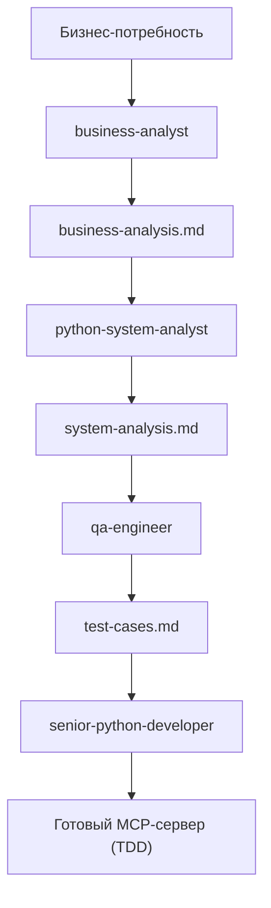

# Разработка Zabbix MCP-сервера

## Workflow (5 шагов)

## Шаги

**Шаг 1: Бизнес-анализ** — `business-analyst`
- Запускаем субагент `business-analyst`
- Результат: `business-analysis.md` — персоны, болевые точки, user stories, функциональные требования к MCP-серверу (10-15 требований, 6-10 user stories)

**Шаг 2: Системный анализ** — `python-system-analyst`
- Входные данные: `business-analysis.md`
- Результат: `system-analysis.md` — архитектура MCP-сервера, технологический стек, API-дизайн, функциональные и нефункциональные требования

**Шаг 3: Тест-кейсы** — `qa-engineer`
- Входные данные: `system-analysis.md`
- Результат: `test-cases.md` — позитивные, негативные, граничные и интеграционные тест-кейсы

**Шаг 4: Разработка кода** — `senior-python-developer` (TDD)
- Входные данные: `system-analysis.md` + `test-cases.md`
- Метод: тест → код → рефакторинг
- Результат: готовый Python-код MCP-сервера с проходящими тестами

## Файловая структура (ожидаемая)

- `business-analysis.md` — выход шага 1
- `system-analysis.md` — выход шага 2
- `test-cases.md` — выход шага 3
- `src/` и `tests/` — выход шага 4
